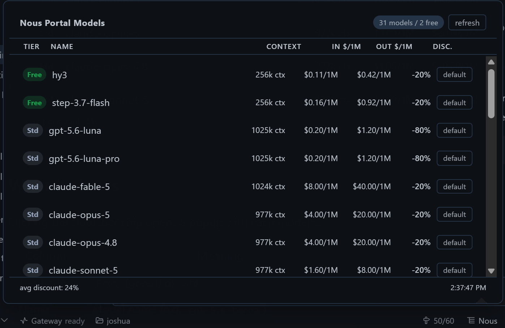

# Nous Models & Pricing — Hermes Desktop Plugin

A Hermes desktop plugin that shows the Nous Portal model catalog with **live**
pricing, original pricing, current discount percentages, context lengths, and
free-tier badges — right in the desktop app's status bar.



- **Statusbar chip** — a catalog icon + "Nous". Click it → a popup panel
  lists every Nous Portal model.
- **Live data** — the plugin fetches the public Nous endpoints directly from
  the browser every 10 minutes. Nothing is baked in, so it always shows the
  current prices without ever regenerating or reinstalling the plugin.

## What it shows

Clicking the statusbar chip opens a popup with each model's:

| Column | Meaning |
|--------|---------|
| Tier badge | `Free` (green) or `Std` |
| Name | Model name (e.g. `gpt-5.6-terra`) |
| In/Out | Current price per 1M input/output tokens (USD) |
| Disc | Average input+output discount % vs original price |

A header shows total / free counts, and a footer shows the average discount
across all models.

## Switching models

Each model row is clickable:

- **Click a row** → sets it as the **current session model** (applies to the
  active chat; a mid-turn switch is deferred by the gateway and lands at the
  next turn).
- **Hover a row → click `default`** → sets it as the **profile default model**
  (applies to new sessions).

Both use the same `config.set` gateway RPC the app's own model picker uses, so
the switch behaves exactly like selecting from the built-in model menu.

## Data sources (public, CORS-enabled — fetched by the plugin directly)

- **Model catalog**: [`model-catalog.json`](https://hermes-agent.nousresearch.com/docs/api/model-catalog.json) — curated Nous Portal model IDs (redirects to nousresearch.github.io, CORS-enabled)
- **Pricing**: [`/v1/models`](https://inference-api.nousresearch.com/v1/models) — current + original pricing (for discount %), context length, `:free` variants

Free-tier detection: a catalog model is flagged `Free` when a matching `:free`
variant exists in `/v1/models` with $0 pricing.

## Install

1. Create the folder and copy the plugin:

   ```
   mkdir -p %LOCALAPPDATA%\hermes\desktop-plugins\nous-models
   copy plugin.js %LOCALAPPDATA%\hermes\desktop-plugins\nous-models\plugin.js
   ```

   If your desktop runs under a named profile (e.g. `reviewer`), also copy it
   there:
   ```
   %LOCALAPPDATA%\hermes\profiles\reviewer\desktop-plugins\nous-models\plugin.js
   ```

2. In Hermes Desktop: **Ctrl+K / ⌘K → Reload desktop plugins**.

3. The chip appears in the bottom-right status bar. Click it to view the models.

No Python backend, no config change, no gateway restart — it's a single
self-contained file.

## Dev

Self-contained plain-JS ESM plugin. Only `@hermes/plugin-sdk`, `react`, and
`react/jsx-runtime` resolve. UI uses `jsx()` calls (not JSX syntax); the file
is loaded uncompiled.

## License

MIT — see [LICENSE](LICENSE).

## Disclaimer

The model prices shown by this plugin are provided for **reference only** and are fetched live from public Nous Portal endpoints. While the plugin aims to always reflect current prices, prices, discounts, and model availability can change at any time, and the plugin may occasionally display stale or incorrect data.

By installing and using this plugin, you agree that the pricing information is presented **as-is**, without warranty of accuracy or completeness, and that the author is **not responsible** for any unexpected costs incurred from model usage based on the pricing shown.
